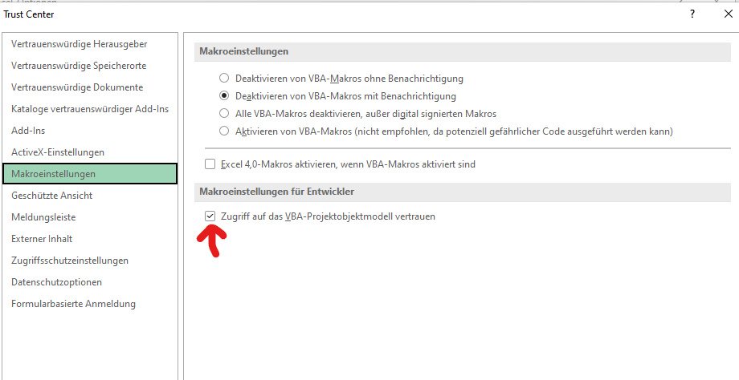
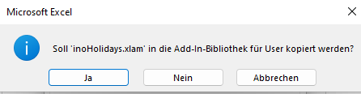
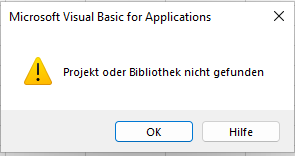
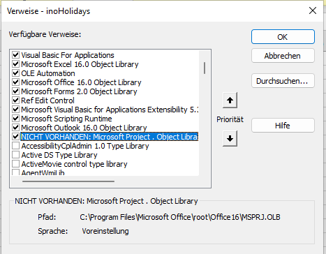

# Excel Add-In to Export a CSV file with free choice of delimiter

## Installation

Download the file XX to your system and unzip the content.

In Excel use File - Options

First adjust some settings within Excel.

Open File - Options - Trust center - Trust Center Settings

Navigate to Macro settings and activate Grand accees to VBA-project object model

Next add the Add-In to Excel 

Open File - Options

Choose tab Add-ins and select "Manage Excel-Add-Ins" and click go.

Use "Browse" to select inoHolidays.xlam and make sure inoHolidays is ticked.

If you are prompted for Copy "inoHolidays.xlam" to Add-In-Library click NO.

If you have no MS Project installed the folloing messages will occur during the installation:

Both messages can be finished with OK.

Now the Add-In is available.

## Usage

### Ribbon

